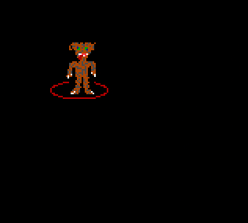

# Move!

This is a graphics demo I wrote in QBasic back when I was a teenager. 
The code was miraculously preserved on [Pete's QBasic site](http://petesqbsite.com/), where I [submitted it for review](http://petesqbsite.com/reviews/graphics/move.html) getting a respectable 80%. It still works in DosBox.



## Instructions for running
- Install [DosBox](https://www.dosbox.com/)
- Download [QBasic](https://www.qbasic.net/en/qbasic-tutorials/dosbox/qbasic-dosbox-1.htm)
- In the qb45 directory, create the directory `move` and put the two files in that.

```
mount c ~/Downloads/qb45 
c:
qb /L /RUN move\move.bas
```

The /L flag is to load the libraries required for the maths.

CTRL-F10 to release the mouse.